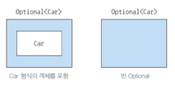
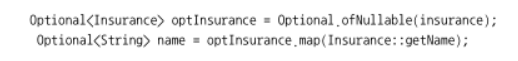
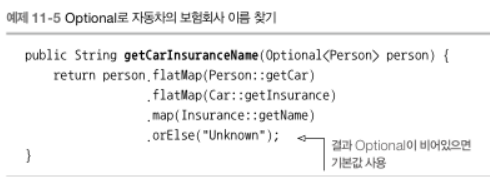

null 때문에 발생하는 문제
- 에러의 근원 : NPE는 자바에서 가장 흔히 발생하는 에러
- 코드를 어지럽힌다 : 때로는 중첩된 null 확인 코드를 추가해야 하므로 null 때문에 코드 가독성이 떨어진다.
- 아무 의미가 없다 : null은 아무 의미도 표현하지 않는다.
- 자바 철학에 위배된다 : 자바는 개발자로부터 모든 포인터를 숨겼다. 하지만 null 포인터는 숨기지 않았다.
- 형식 시스템에 구멍을 만든다 : null은 무형식이며 정보를 포함하고 있지 않으므로 모든 참조 형식에 null을 할당 할 수 있다. 이런 식으로 null이 할당되기 시작하면서 시스템의 다른 부분을 null이 퍼졌을 때 애초에 null이 어떤 의미로 사용되었는지 알 수 없다.

자바 8은 '선택형값' 영향을 받아서 java.util.Optional<T> 라는 새로운 클래스 제공.

값이 있으면 Optional 클래스는 값을 감쌈.
값이 없으면 Optional.empty 메서드로 Optional을 반환함.

null을 참조하려 하면 NPE가 발생하지만 Optional.empty()는 Optional 객체 이므로 이를 다양한 방식으로 활용할 수 있다.

또한 null 대신 Optional<Car> 형식으로 바뀌었을 때 이는 값이 없을 수 있음을 명시적으로 보여줌.

Optional 클래스를 사용하면서 모델의 의미가 더 명확해졌다.

### Optional 객체 만들기
1. 빈 Optioanl
    Optional<Car> optCar = Optional.empty();
2. null이 아닌 값으로 Optional 만들기
    Optional<Car> optCar = Optional.of(car);
3. null값으로 Optional 만들기
    Optional<Car> optCar = Optional.ofNullable(car);

### 맵으로 Optional의 값을 추출하고 변환하기

스트림의 map 메서드와 개념적으로 비슷.
Optional이 비어있으면 아무 일도 일어나지 않는다.

null을 확인하느라 조건 분기문을 추가해서 코드를 복잡하게 만들지 않으면서도 쉽게 이해 가능한 코드 완성!

