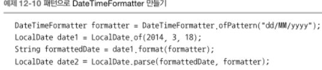

# 새로운 날짜와 시간 API
LocalDate
- 시간을 제외한 날짜를 표현하는 불변 객체
- 어떤 시간대 정보도 포함하지 않음
- LocalDate.now() 현재 날짜 정보를 얻음

LocalTime
- 시간을 표현하는 불변 객체
- getter 메서드 제공
- LocalTime time = LocalTime.of(13, 45, 20); -> 13:45:20

LocalDateTime은 LocalDate와 LocalTime을 쌍으로 갖는 복합 클래스

Instant 클래스 : 기계의 날짜와 시간
기계적인 관점에서 시간을 표현함. 사람이 읽을 수 있는 시간 정보를 제공하지 않음.

DateTimeFormatter : 정적 팩토리 메서드와 상수를 이용해서 손쉽게 포매터를 만들 수 있음.

- 자바 8 이전에서 제공하는 기존의 java.util.Date 클래스와 관련 클래스에서는 여러 불일치점들과 가변성, 어설픈 오프셋, 기본값, 잘못된 이름 결정 등의 설계 결함이 존재
- 새로운 날짜와 시간 API 에서 날짜와 시간 객체는 모두 불변
- 새로운 API는 각각 사람과 기계가 편리하게 날짜와 시간 정보를 관리할 수 있도록 두 가지 표현 방식을 제공
- 날짜와 시간 객체를 절대적인 방법과 상대적인 방법으로 처리할 수 있으며 기존 인스턴스를 변환하지 않도록 처리 결과로 새로운 인스턴스 생성
- TemporalAdjuster를 이용하면 단순히 값을 바꾸는 것 이상의 복잡한 동작 수행 가능. 커스텀 날짜 변환 기능 정의 가능
- 포매터 정의 가능. 패턴을 이용하거나 프로그램으로 포매터를 만들 수 있으며 포매터는 스레드 안정성을 보장.
- ISO-8601 표준 시스템을 준수하지 않는 캘린더 시스템도 사용 가능

