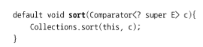

# 디폴트 메서드
자바 8에서는 기본 구현을 포함하는 인터페이스를 정의하는 두 가지 방법을 제공.
1. 인터페이스 내부에 정적 메서드 사용
2. 인터페이스의 기본 구현을 제공할 수 있도록 디폴트 메서드 기능 사용

반환 형식 void 앞에 default 라는 새로운 키워드 등장

디폴트 메서드 탄생 이유?
디폴트 메서드가 없던 시절 인터페이스에 메서드를 추가하면 여러 문제 발생.
인터페이스에 새로 추가된 메서드를 구현하도록 인터페이스를 구현하는 기존 클래스를 고쳐햐 함.
본인이 관리할 수 있는 상황이면 어렵지 않지만 대중에 공개했을 때 문제 발생.
디폴트 메서드를 이용하면 인터페이스의 기본 구현을 그대로 상속. 인터페이스가 자유롭게 새로운 메서드 추가할 수 있게됨.

추상 클래스와 자바 8의 인터페이스의 차이
- 클래스는 하나의 추상 클래스만 상속받을 수 있지만 인터페이스를 여러 개 구현할 수 있다.
- 추상 클래스는 인스턴스 변수(필드)로 공통 상태를 가질 수 있다. 하지만 인터페이스는 인스턴스 변수를 가질 수 없다.

모든 추상 메서드의 구현은 제공해야 하지만 디폴트 메서드의 구현은 제공할 필요 X

다른 클래스나 인터페이스로부터 같은 시그니처를 갖는 메서드를 상속받을 때는 세 가지 규칙 존재
1. 클래스가 항상 이긴다. 클래스나 슈퍼클래스에서 정의한 메서드가 디폴트 메서드보다 우선권을 가짐
2. 1번 규칙 이외의 상황에서는 서브인터페이스가 이김. 상속관계를 갖는 인터페이스에서 같은 시그니처를 갖는 메서드를 정의할 때는 서브인터페이스가 이김.
3. 여전히 디폴트 메서드의 우선순위가 결정되지 않았다면 여러 인터페이스를 상속받는 클래스가 명시적으로 디폴트 메서드를 오버라이드하고 호출해야함.

- 자바 8의 인터페이스는 구현 코드를 포함하는 디폴트 메서드, 정적 메서드를 정의 할 수 있음
- 디폴트 메서드의 정의는 default 키워드로 시작하며 일반 클래스 메서드처럼 바디를 갖는다.
- 공개된 인터페이스에 추상 메서드를 추가하면 소스 호환성이 깨짐
- 디폴트 메서드 덕분에 라이브러리 설계자가 API를 바꿔도 기존 버전과 호환성을 유지할 수 있음
- 선택형 메서드와 동작 다중 상속에도 디폴트 메서드를 사용할 수 있음
- 클래스가 같은 시그니처를 갖는 여러 디폴트 메서드를 상속하면서 생기는 충돌 문제를 해결하는 규칙 존재
- 클래스나 슈퍼클래스에 정의된 메서드가 다른 디폴트 메서드 정의보다 우선. 이 외의 상황에서는 서브 인터페이스에서 제공하는 디폴트 메서드가 선택됨
- 두 메서드의 시그니처가 같고, 상속관계로도 충돌 문제를 해결할 수 없을 때 디폴트 메서드를 사용하는 클래스에서 메서드를 오버라이드해서 어떤 디폴트 메서드를 호출할지 명시적으로 결정해야 함.