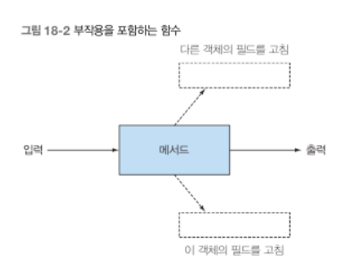

# 함수형 관점으로 생각하기
함수형 프로그래밍이란?
여기서의 함수란 수학적인 함수와 같다. 함수는 0개 이상의 인수를 가지며, 한 개 이상의 결과를 반환하지만 부작용이 없어야 한다.

함수형이라는 말은 '수학의 함수처럼 부작용이 없는'을 의미한다.
함수형이라면 함수나 메서드가 어떤 예외도 일으키지 않아야 함.

- 공유된 가변 자로구조를 줄이는 것은 장기적으로 프로그램을 유지보수하고 디버깅하는데 도움됨
- 함수형 프로그래밍은 부작용이 없는 메서드와 선언형 프로그래밍 방식을 지향
- 함수형 메서드는 입력 인수와 출력 결과만을 가짐
- 같은 인수값으로 함수를 호출했을 때 항상 같은 값을 반환하면 참조 투명성을 갖는 함수. while 루프 같은 반복문은 재귀로 대체 가능
- 자바에서는 고전 방식의 재귀보다는 꼬리 재귀를 사용해야 추가적인 컴파일러 최적화를 기대할 수 있음

