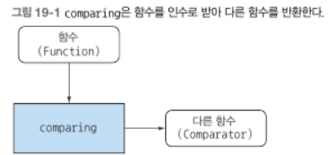

# 함수형 프로그래밍 기법

고차원 함수
- 하나 이상의 함수를 인수로 받음
- 함수를 결과로 반환

커링
함수를 모듈화하고 코드를 재사용하는데 도움을 주는 기법
x와 y라는 두 인수를 받는 함수 f를 한 개의 인수를 받는 g라는 함수로 대체하는 기법.
g라는 함수 역시 하나의 인수를 받는 함수를 반환.

스트림은 단 한번만 소비할 수 있다는 제약이 있어서 스트림은 재귀적으로 정의할 수 없음

- 일급 함수란 인수로 전달하거나, 결과로 반환하거나, 자료구조에 저장할 수 있는 함수
- 고차원 함수란 한 개 이상의 함수를 인수로 받아서 다른 함수를 반환하는 함수.
- 커링은 함수를 모듈화하고 코드를 재사용할 수 있도록 지원하는 기법
- 영속 자료구조는 갱신될 때 기존 버전의 자신을 보존.
- 자바의 스트림은 스스로 정의할 수 없음
- 게으른 리스트는 자바 스트림보다 비싼 버전으로 간주할 수 있음
- 패턴 매칭은 자료형을 언햅하는 함수형 기능
- 참조 투명성을 유지하는 상황에서는 계산 결과를 캐시할 수 있음
- 콤비네이터는 둘 이상의 함수나 자료구조를 조합하는 함수형 개념