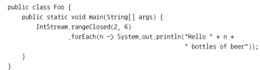
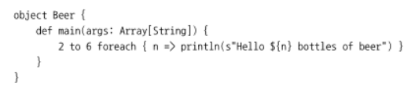

# OOP와 FP의 조화:자바와 스칼라 비교
스칼라?
객체지향과 함수형 프로그래밍을 혼합한 언어
복잡한 형식 시스템, 형식 추론, 패턴 매칭, 도메인 전용 언어를 단순하게 정의할 수 있는 구조 등을 제공
스칼라 코드에서는 모든 자바 라이브러리 사용 가능

자바 코드 구현

스칼라 코드 구현

스칼라에는 기본형이 없다. 스칼라는 자바보다 완전한 객체지향 언어다.

- 자바와 스칼라는 객체지향과 함수형 프로그래밍 모두를 하나의 프로그래밍 언어로 수용
- 스칼라는 자바처럼 리스트, 집합, 맵, 스트림, 옵션 등의 추상 컬렉션을 제공
- 스칼라는 자바에 비해 풍부한 함수 관련 기능 제공. 함수 형식, 지역 변수에 접근할 수 있는 클로저, 내장 커링 형식 등을 지원
- 스칼라의 클래스는 암묵적으로 생성자, 게터, 세터를 제공
- 트레이트를 지원. 트레이트는 필드와 디폴트 메서드를 포함할 수 있는 인터페이스.

